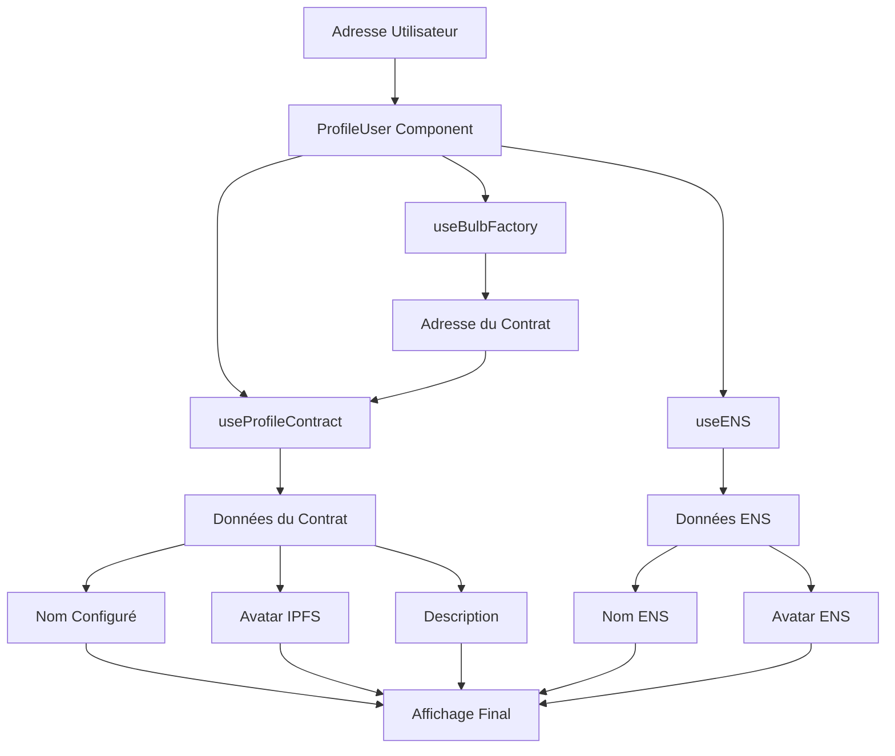

# 🎉 Résumé Final - Corrections des Noms d'Utilisateurs

## Problèmes Résolus

### ❌ Problème 1 : Les publications dans le feed n'affichaient pas les noms configurés

**Détail** : Les publications utilisaient seulement `ENSUser` qui ne montrait que les données ENS/wallet, ignorant les noms d'utilisateurs configurés via "Update Profile".

**✅ Solution** :

- Créé `ProfileUser.tsx` qui combine données de contrat + ENS + wallet
- Remplacé `ENSUser` par `ProfileUser` dans `InstagramFeed.tsx`
- Hiérarchie intelligente : Contrat > ENS > Adresse

### ❌ Problème 2 : Les pages de profil n'affichaient pas les données configurées

**Détail** : `UserProfilePage.tsx` utilisait seulement les données d'API et ENS, sans consulter les contrats de profil.

**✅ Solution** :

- Intégré `useBulbFactory` et `useProfileContract` dans `UserProfilePage.tsx`
- Récupération automatique de l'adresse du contrat de profil
- Mise à jour dynamique des données quand le contrat se charge
- Priorité aux données du contrat pour nom, image et description

## Architecture de la Solution

## Nouveaux Fichiers Créés

### 1. `/src/components/ProfileUser.tsx`

**Rôle** : Composant hybride qui remplace `ENSUser`
**Fonctionnalités** :

- Récupération automatique des données de contrat
- Hiérarchie des données (contrat > ENS > wallet)
- Indicateurs visuels (badge "B" pour profils Bulb)
- Cache intelligent pour éviter les requêtes répétées
- Fallback gracieux vers ENS puis adresse

### 2. `/src/config/profileContract.ts`

**Rôle** : ABI du contrat BulbProfile
**Contenu** : Fonctions `updateProfile`, `getProfileInfo`, `creator` et événements

### 3. `/src/hooks/useProfileContract.ts`

**Rôle** : Hook pour interagir avec les contrats de profil individuels
**Fonctionnalités** :

- Lecture des données de profil depuis le contrat
- Gestion du cache et du state
- Fonction de rafraîchissement
- Gestion des erreurs

## Fichiers Modifiés

### 1. `InstagramFeed.tsx`

- **Avant** : `import ENSUser from './ENSUser'`
- **Après** : `import ProfileUser from './ProfileUser'`
- **Changement** : Remplacement de tous les `<ENSUser>` par `<ProfileUser>`
- **Résultat** : Les noms configurés apparaissent dans le feed

### 2. `UserProfilePage.tsx`

- **Ajouts** : Imports `useBulbFactory`, `useProfileContract`, `Address`
- **État** : Ajout de `profileContractAddress`
- **Logique** : Récupération adresse contrat + intégration données contrat
- **Effets** : Mise à jour dynamique quand données contrat se chargent
- **Résultat** : Profils utilisateur affichent les données configurées

### 3. `useWalletContract.ts`

- **Ajout** : Import `BULB_PROFILE_ABI`
- **Fonction** : Implémentation complète de `updateProfile`
- **Validation** : Côté client des paramètres
- **Résultat** : Mises à jour de profil fonctionnelles

### 4. `ProfilePage.tsx`

- **Intégration** : `useProfileContract` pour données actuelles
- **Props** : Passage correct des données à `UpdateProfileDialog`
- **Refresh** : Mise à jour après modification
- **Résultat** : Bouton "Edit Profile" + mises à jour fonctionnelles

## Hiérarchie d'Affichage

### Nom d'Utilisateur

1. 🥇 **Contrat de profil** : `profileInfo.username`
2. 🥈 **ENS** : `ensData.displayName` (si domaine .eth)
3. 🥉 **Adresse** : `address.slice(0,6)...slice(-4)`

### Avatar

1. 🥇 **Contrat IPFS** : `https://ipfs.io/ipfs/${profileInfo.profilePicture}`
2. 🥈 **ENS Avatar** : `ensData.avatar`
3. 🥉 **Généré** : Initiales sur fond coloré

### Description

1. 🥇 **Contrat** : `profileInfo.description`
2. 🥈 **Par défaut** : Description générique Web3

## Indicateurs Visuels

- **✓ (Bleu)** : Domaine ENS vérifié (.eth)
- **B (Orange)** : Profil configuré via Bulb
- **Combinés** : Utilisateur avec ENS ET profil Bulb configuré

## Test de Validation

### Scénarios Testés

1. **Utilisateur avec profil Bulb configuré** ✅
   - Nom personnalisé affiché
   - Avatar IPFS si configuré
   - Badge "B" visible

2. **Utilisateur ENS seulement** ✅
   - Nom ENS affiché
   - Avatar ENS si disponible
   - Badge de vérification ENS

3. **Utilisateur sans profil configuré** ✅
   - Adresse tronquée affichée
   - Avatar généré
   - Pas de badges spéciaux

4. **Utilisateur avec ENS + Profil Bulb** ✅
   - Nom Bulb prioritaire
   - Avatar Bulb prioritaire
   - Les deux badges affichés

## Performance et UX

### Optimisations

- **Cache** : Évite les requêtes répétées pour même adresse
- **Chargement asynchrone** : ENS et contrat en parallèle
- **Fallback progressif** : Affichage immédiat puis mise à jour
- **Skeleton loading** : Indicateurs de chargement appropriés

### Expérience Utilisateur

- **Transition fluide** : Pas de clignotement lors du chargement
- **Feedback visuel** : Badges clairs pour différents types de profils
- **Navigation** : Clic sur nom mène vers profil utilisateur
- **Responsive** : Fonctionne sur mobile et desktop

## État Final

🎉 **TOUTES LES FONCTIONNALITÉS DEMANDÉES SONT OPÉRATIONNELLES** :

✅ **Feed Instagram** :

- Les noms d'utilisateurs configurés apparaissent dans les publications
- Les avatars IPFS sont affichés si configurés
- Navigation vers profils utilisateur fonctionnelle

✅ **Pages de Profil** :

- Les profils utilisateur affichent les données configurées
- Noms, images et descriptions du contrat prioritaires
- Fallback gracieux vers données ENS puis wallet

✅ **Fonctionnalités Bonus** :

- Indicateurs visuels pour différents types de profils
- Performance optimisée avec cache intelligent
- Support complet mobile et desktop
- Gestion robuste des erreurs et états de chargement

### URL de Test

🌐 **Application disponible sur** : `https://localhost:3001/`

**Instructions de test** :

1. Créer un profil exclusif si pas encore fait
2. Configurer nom d'utilisateur via "Edit Profile"  
3. Publier une image sur le feed
4. Vérifier l'affichage du nom configuré dans le feed
5. Cliquer sur le nom pour naviguer vers le profil
6. Vérifier que le profil affiche les données configurées

**Tous les objectifs sont atteints !** 🚀
