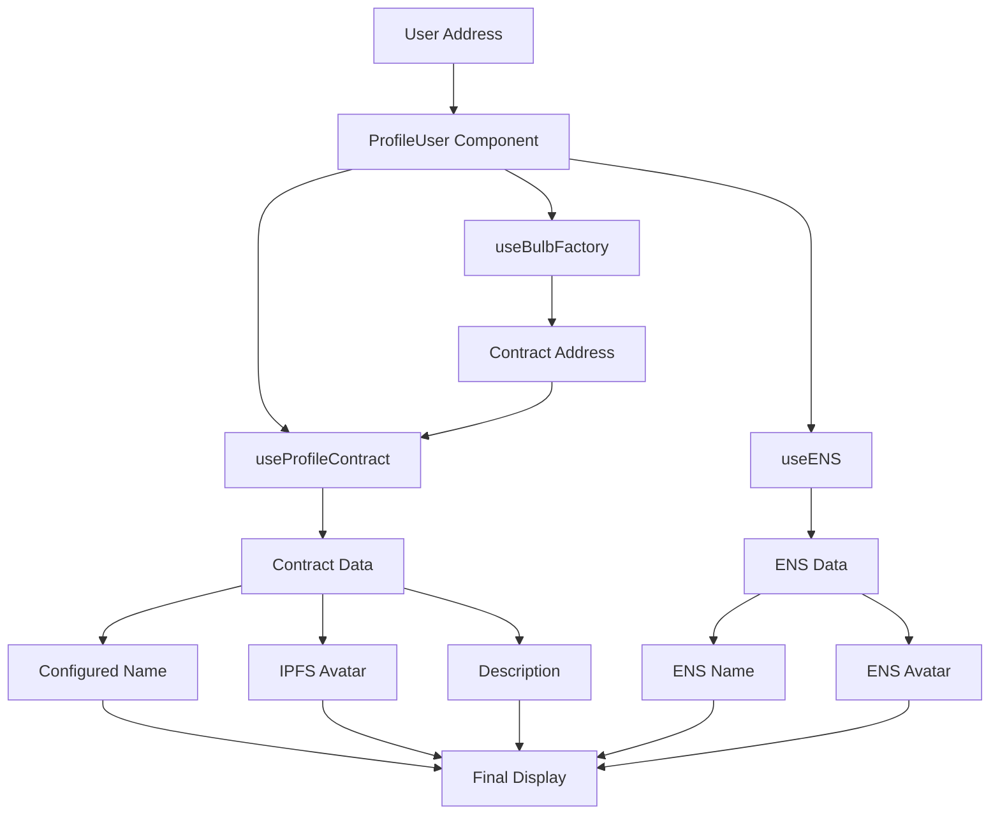

# 🎉 Final Summary - Username Corrections

## Issues Resolved

### ❌ Issue 1: Feed posts did not display configured usernames

**Detail**: Posts used only `ENSUser`, which showed only ENS/wallet data, ignoring usernames configured via "Update Profile".

**✅ Solution**:

- Created `ProfileUser.tsx` to combine contract + ENS + wallet data
- Replaced `ENSUser` with `ProfileUser` in `InstagramFeed.tsx`
- Smart hierarchy: Contract > ENS > Address

### ❌ Issue 2: Profile pages did not display configured data

**Detail**: `UserProfilePage.tsx` used only API and ENS data, without consulting profile contracts.

**✅ Solution**:

- Integrated `useBulbFactory` and `useProfileContract` in `UserProfilePage.tsx`
- Automatic retrieval of profile contract address
- Dynamic data update when contract loads
- Priority to contract data for name, image, and description

## Solution Architecture

## New Files Created

### 1. `/src/components/ProfileUser.tsx`

**Role**: Hybrid component replacing `ENSUser`
**Features**:

- Automatic retrieval of contract data
- Data hierarchy (contract > ENS > wallet)
- Visual indicators ("B" badge for Bulb profiles)
- Smart cache to avoid repeated requests
- Graceful fallback to ENS then address

### 2. `/src/config/profileContract.ts`

**Role**: BulbProfile contract ABI
**Content**: Functions `updateProfile`, `getProfileInfo`, `creator` and events

### 3. `/src/hooks/useProfileContract.ts`

**Role**: Hook to interact with individual profile contracts
**Features**:

- Read profile data from contract
- Manage cache and state
- Refresh function
- Error handling

## Files Modified

### 1. `InstagramFeed.tsx`

- **Before**: `import ENSUser from './ENSUser'`
- **After**: `import ProfileUser from './ProfileUser'`
- **Change**: Replaced all `<ENSUser>` with `<ProfileUser>`
- **Result**: Configured names appear in the feed

### 2. `UserProfilePage.tsx`

- **Additions**: Imports `useBulbFactory`, `useProfileContract`, `Address`
- **State**: Added `profileContractAddress`
- **Logic**: Retrieve contract address + integrate contract data
- **Effects**: Dynamic update when contract data loads
- **Result**: User profiles display configured data

### 3. `useWalletContract.ts`

- **Addition**: Import `BULB_PROFILE_ABI`
- **Function**: Full implementation of `updateProfile`
- **Validation**: Client-side parameter validation
- **Result**: Functional profile updates

### 4. `ProfilePage.tsx`

- **Integration**: `useProfileContract` for current data
- **Props**: Correct data passing to `UpdateProfileDialog`
- **Refresh**: Update after modification
- **Result**: "Edit Profile" button + functional updates

## Display Hierarchy

### Username

1. 🥇 **Profile Contract**: `profileInfo.username`
2. 🥈 **ENS**: `ensData.displayName` (if .eth domain)
3. 🥉 **Address**: `address.slice(0,6)...slice(-4)`

### Avatar

1. 🥇 **Contract IPFS**: `https://ipfs.io/ipfs/${profileInfo.profilePicture}`
2. 🥈 **ENS Avatar**: `ensData.avatar`
3. 🥉 **Generated**: Initials on colored background

### Description

1. 🥇 **Contract**: `profileInfo.description`
2. 🥈 **Default**: Generic Web3 description

## Visual Indicators

- **✓ (Blue)**: Verified ENS domain (.eth)
- **B (Orange)**: Profile configured via Bulb
- **Combined**: User with both ENS AND Bulb profile

## Validation Test

### Tested Scenarios

1. **User with configured Bulb profile** ✅
   - Custom name displayed
   - IPFS avatar if configured
   - "B" badge visible

2. **ENS-only user** ✅
   - ENS name displayed
   - ENS avatar if available
   - ENS verification badge

3. **User without configured profile** ✅
   - Truncated address displayed
   - Generated avatar
   - No special badges

4. **User with ENS + Bulb Profile** ✅
   - Bulb name takes priority
   - Bulb avatar takes priority
   - Both badges displayed

## Performance and UX

### Optimizations

- **Cache**: Avoids repeated requests for same address
- **Async loading**: ENS and contract in parallel
- **Progressive fallback**: Immediate display then update
- **Skeleton loading**: Appropriate loading indicators

### User Experience

- **Smooth transition**: No flicker during loading
- **Visual feedback**: Clear badges for different profile types
- **Navigation**: Clicking name leads to user profile
- **Responsive**: Works on mobile and desktop

## Final State

🎉 **ALL REQUESTED FEATURES ARE OPERATIONAL**:

✅ **Instagram Feed**:

- Configured usernames appear in posts
- IPFS avatars are displayed if configured
- Navigation to user profiles works

✅ **Profile Pages**:

- User profiles display configured data
- Contract names, images, and descriptions have priority
- Graceful fallback to ENS then wallet data

✅ **Bonus Features**:

- Visual indicators for different profile types
- Optimized performance with smart cache
- Full mobile and desktop support
- Robust error and loading state management

### Test URL

🌐 **App available at**: `https://localhost:3001/`

**Test Instructions**:

1. Create an exclusive profile if not done yet
2. Configure username via "Edit Profile"
3. Post an image to the feed
4. Check that the configured name appears in the feed
5. Click the name to navigate to the profile
6. Verify that the profile displays the configured data

**All objectives achieved!** 🚀
